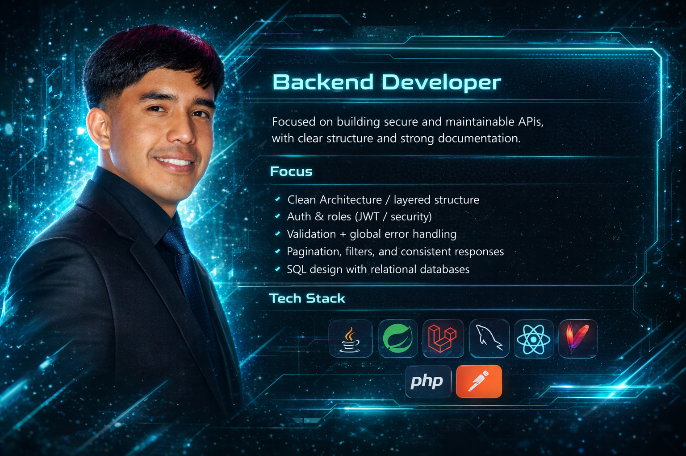

<!-- =========================
   Raul Díaz Díaz — Profile README
   ========================= -->

<h1 align="center">Raul Díaz Díaz</h1>

  <b>Backend Developer</b> — Java • Spring Boot • Laravel • React • REST APIs • MySQL • Clean Architecture

  
  &nbsp;&nbsp;
  
  &nbsp;&nbsp;
  

---

  

---

## Profile

Backend developer focused on building secure and maintainable APIs, with clear structure and strong documentation.

---

## Focus

- Clean Architecture / layered structure  
- Auth & roles (JWT / security)  
- Validation + global error handling  
- Pagination, filters, and consistent responses  
- SQL design with relational databases  

---

## Tech Stack

  
  
  

  
  
  

  
  
  

---

## Featured Projects

### 1) REPO_1 — Desktop program for managing auto parts stores
**Highlights:** Desktop application for hardware store management built with Java and Swing.
**Repo:** [https://github.com/Raul-dd/TU_REPO_1  ](https://github.com/Raul-dd/ferreteria-desktop-java.git)

### 2) REPO_2 — Functional programming exercise in Java
**Highlights:** Java functional programming exercise using Streams, Lambdas, Collectors and parallel streams to process supermarket product data.
**Repo:** [https://github.com/Raul-dd/TU_REPO_2  ](https://github.com/Raul-dd/java-streams-supermarket-exercise.git)

### 3) REPO_3 — Simple CRUD in Spring Boot
**Highlights:** Simple CRUD of users with Spring Boot (REST API).
**Repo:** [https://github.com/Raul-dd/TU_REPO_3 ](https://github.com/Raul-dd/springboot-users-crud.git) 

---

## Contact

- 🔗 LinkedIn: https://www.linkedin.com/in/raul-dd/  
- 📧 Email: raulddev@gmail.com  
- 📍 Hidalgo, Mexico  
