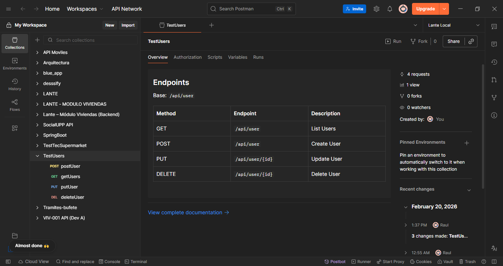
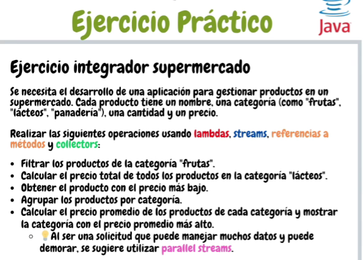
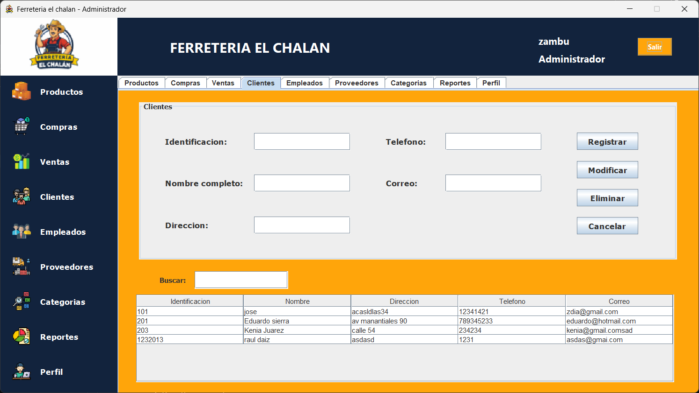

<h1 align="center">Hi 👋 I'm Raul Díaz Díaz / Raul-dd ✨</h1>

  <b>Backend Developer</b> • Java • Spring Boot • Laravel • React • REST APIs • Clean Architecture • SQL

  
  &nbsp;&nbsp;
  
  &nbsp;&nbsp;
  

---

## About me 😃

- 🎓 **Backend Developer** focused on building clean, scalable, and maintainable APIs.
- 🧠 I like applying **Clean Architecture**, best practices, validations, and solid error handling.
- 🚀 Main stack: **Java + Spring Boot** (REST APIs). Also familiar with **Laravel** and **React**.
- 📫 Contact: **raulddev@gmail.com**

---

## Tech stack 👨🏻‍💻

  

---

## Java projects ☕️

<table>
  <tr>
    <td width="33%" valign="top">
      
       
      
        
      Simple user CRUD with Spring Boot (REST API).
    </td>
    <td width="33%" valign="top">
      
       
      
        
      Streams, Lambdas & Collectors exercises.
    </td>
    <td width="33%" valign="top">
      
       
      
        
      Java Swing desktop app for hardware store management.
    </td>
  </tr>
</table>
